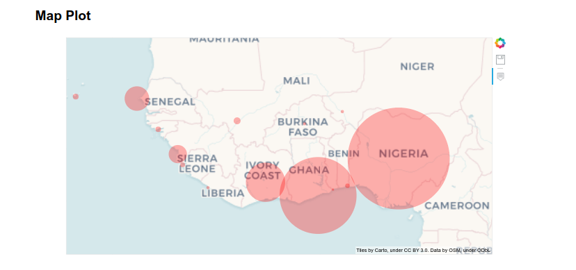
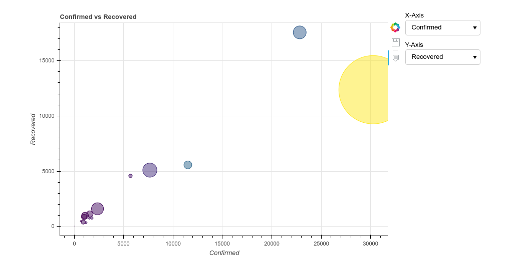

### Ecowas Covid19 Tracker
Ecowas Covid19 Tracker is a dashboard built with Python and Bokeh. The graphics are interactice, provide possibilities to select features....

### Source
Data are downloaded from https://github.com/CSSEGISandData/COVID-19

### Technos
* Python
* Pandas
* Bokeh
* AddThis
* Facebook Comments Plugin
* Facbook Like

---
*Disclaimer: This project has no relation with ECOWAS Organization. Please contact joseph.kakone@gmail.com for more informations.*